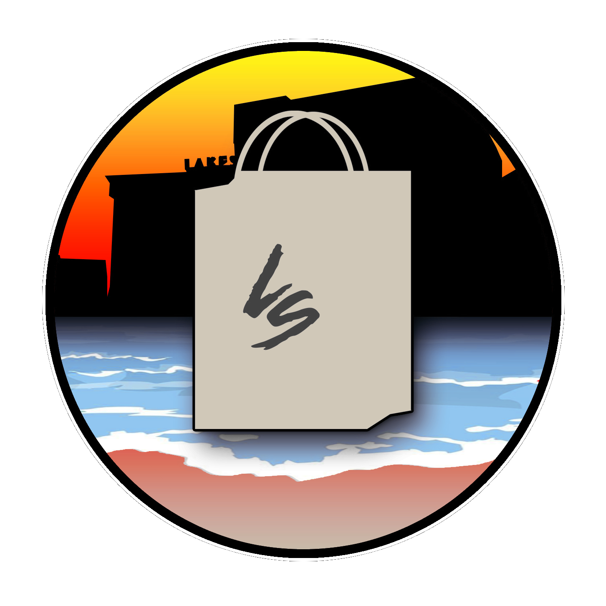

 

# Project Lakeside Mall

We're **creating** a documentary about Michigan malls. We'd **love** your help.
#### View this repository on [Codeberg][01] or [GitHub][02].
[01]: https://codeberg.org/portellam/project-lakeside-mall
[02]: https://github.com/portellam/project-lakeside-mall
##

## Table of Contents
- [1. Why](#1-why)
- [2. Download](#2-download)
- [3. How to Navigate](#3-how-to-navigate)
- [4. Disclaimer](#4-disclaimer)
- [5. Contributors](#5-contributors)
- [6. Contact](#6-contact)

## Contents

### 1. Why
Knowledge base and backup of documentation for *Project Lakeside Mall*.

### 2. Download
To download this repository and it's contents:
- if viewing on GitHub, [click here][21].
- if viewing on Codeberg, [click here][22].

[21]: https://github.com/portellam/project-lakeside-mall/releases/latest
[22]: https://codeberg.org/portellam/project-lakeside-mall/releases/latest

### 3. How to Navigate
Folders are ordered from short-term work, to long-term and archived work.

You may find anything of the following here:
- Archives
- Articles
- Audio
- Blogs
- Events
- File shares
- Instagram
- Media
- News
- Photos
- Public Persons of Interest (not private persons)
- Projects
- Video
- Websites
- YouTube Channels

### 4. Disclaimer
As of writing (July 11, 2025), this project is **on-going.** This project has
**one** **contributor** (see below). It is not my highest priority to share
research just yet.

If you wish to contribute, contact us via email or any of our socials.
See [6. Contact][41].

[41]: #6-contact

### 5. Contributors
| Privilege | Name         | Contacts     |
| :-------: | ------------ | ------------ |
|  Author   | Alex Portell | [GitHub][51] |

[51]: https://github.com/portellam

### 6. Contact
For our latest methods of contact, please see our [website][61].

[61]: http://www.projectlakesidemall.com